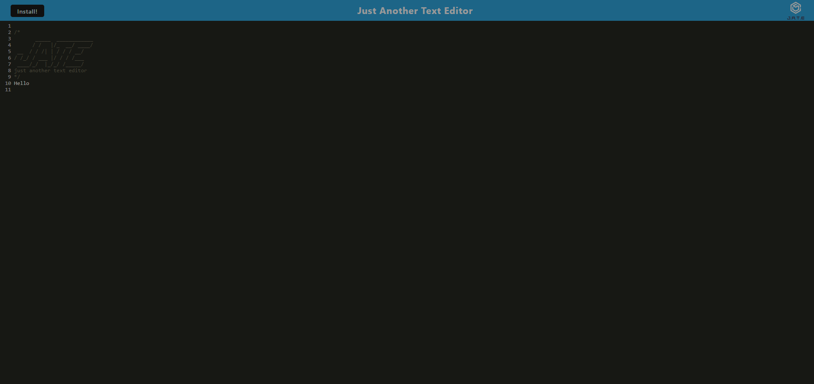

# 19 Progressive Web Applications (PWA): Text Editor

## User Story

```md
AS A developer
I WANT to create notes or code snippets with or without an internet connection
SO THAT I can reliably retrieve them for later use
```

## Installation

If you prefer to deploy this app locally you'll need to do the following:

- Clone the repository to your local machine
- Navigate to the projcet repository
- Type `npm install` in the terminal to install dependencies in the root folder, client folder, and server folder
- Type `npm run start:dev` to build the webpack and run the app
- Navigate to http://localhost:3000 in your browser to view the app



## Deployed Link
https://lit-sierra-49508-82351cb9b240.herokuapp.com/
